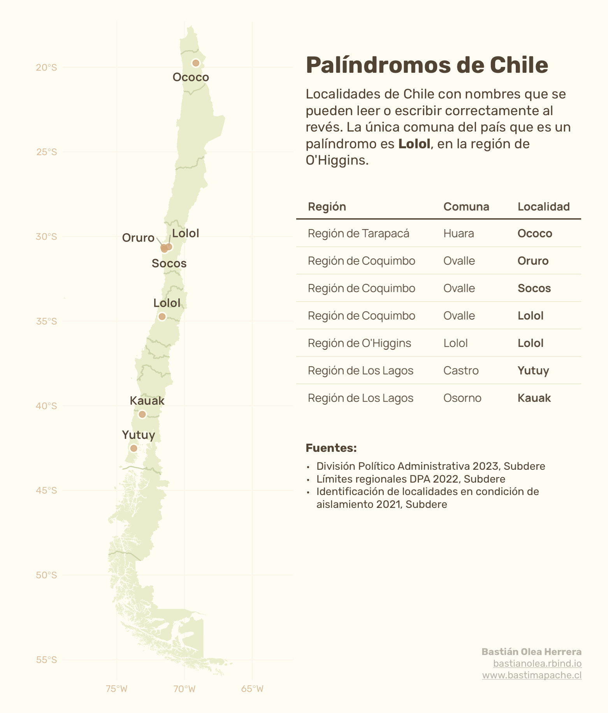

## Palíndromos de Chile

Un palíndromo es una palabra que se puede leer o escribir al revés y al derecho. Por ejemplo, "seres" o "radar" al revés son iguales. 

En Chile sólo hay 1 comuna con un nombre que tenga esta característica, pero sí existen 7 localidades palindrómicas!

